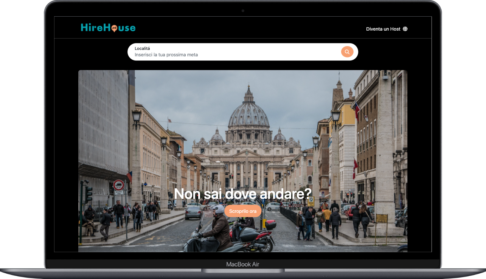
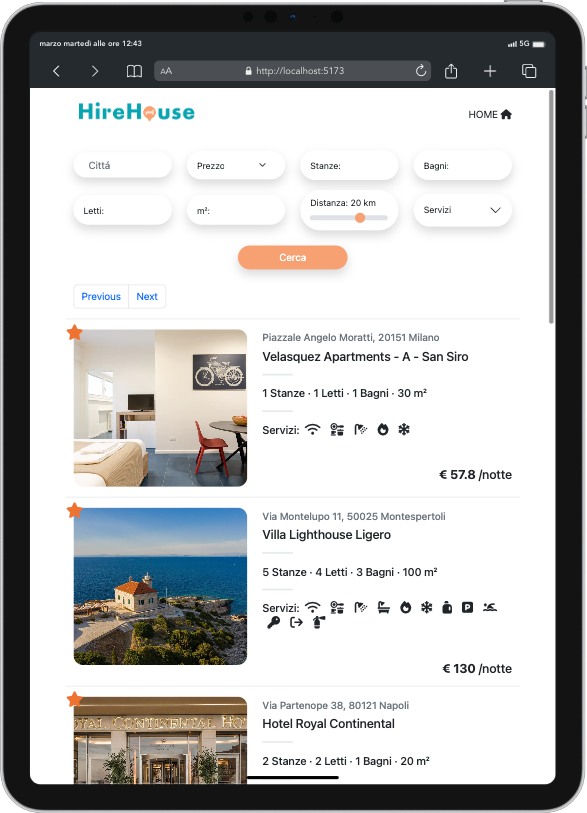
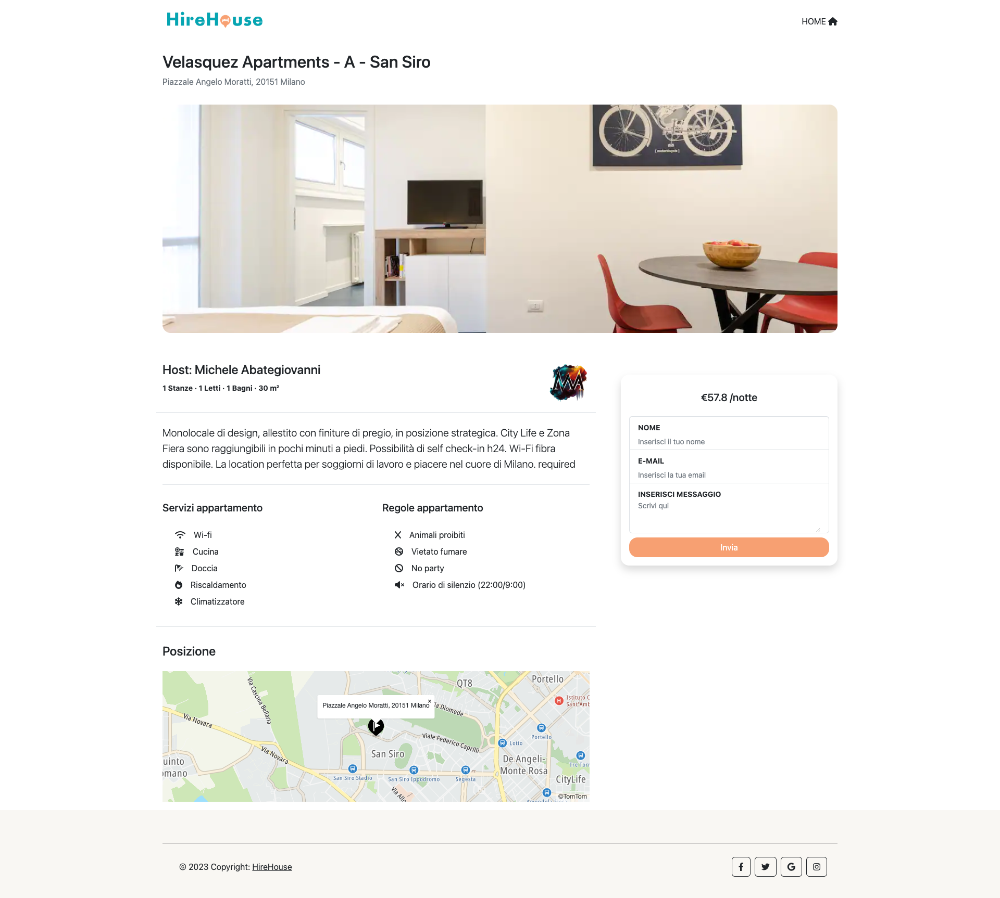

 

 

 
 

# 🏠 <strong>HireHouse - Front-End Project</strong> 

<strong>Hirehouse</strong> is a project based on the famous <strong>AirBnb Web App</strong>.  
This project was <strong>made in team</strong>, where you will find the thanks at the bottom, in three weeks of development.  
It was created through an initial analysis of the layout we wanted to create with the help of <strong>Figma</strong>, and then proceeded to write the code.  
The technologies used were: <strong>HTML5</strong>, <strong>CSS</strong>, <strong>SASS</strong>, <strong>BootStrap</strong>, <strong>JavaScript</strong>, <strong>Vue.js</strong> and <strong>Axios</strong>  

## <strong>About Project</strong>

This project shows the front-end part of our application, which communicates through <strong>APIs</strong>, to the back-end part.
Within the project, we will find three main pages, created with the help of Vue-Router, which are:
- <strong>HomePage</strong> 
- <strong>Index / Research advanced</strong> 
- <strong>Show apartments</strong> 

 

### <strong>HomePage</strong> 

In the Homepage section, we will find the entire initial phase of the web app, i.e. a slider that takes us to the Index page where we can view all the apartments or do some research.
A slider containing all the apartments sponsored by their respective owners.
Links to access the back-end side of the application and finally a section dedicated to the main Italian tourist cities, which will redirect to the Index page with search filters for that selected location.

 

### <strong>Index / Research Advanced</strong> 

In the Index page, we have three methods to enter it:
- Through the <strong> main search navbar </strong>, which redirects us to the Index applying the search filter for that city
- Through a <strong>'Scoprilo Ora'</strong> button located in the main <strong>jumbotron</strong>, which allows us to view all the available apartments
- Through the <strong>footer section</strong> which redirects us to the Index by applying the search filter for the selected city

Inside the page, we have the visualization through the <strong>Cards</strong> to visualize the respective information of the apartment with its relative image.
We also have the possibility through the <strong>sidebar</strong> located at the top of the page, to carry out searches, <strong>to set filters</strong> also on the apartments we want to view.
Everything will be managed through an <strong>API</strong> call, which is generated towards our back-end which will return the desired results through paginations.

 

### <strong>Show</strong>

On the Show page, we will see all the information relating to the selected apartment on the screen, for example: Title, address, image, location of the apartment, etc.  
As far as the <strong>position</strong>  is concerned, the <strong>TomTom map</strong> was used which, through the coordinates stored in our <strong>DB</strong> and received via an <strong>API</strong> call, returns the exact position of the apartment with its relative pop-up marker.  
In addition to these general data, we have the possibility through a form to forward a message to the owner of that apartment by entering the correct data, it will be forwarded and for a few seconds we will see the result of a message sent correctly and then disappear after a set period of time , to allow you to send another message.

 

 

## <strong>Thanks to❤️</strong>

Last but not least, thanks go to my team, which has always been close-knit and collectively ready for the realization of this project and for solving the various difficulties encountered and the bugs fixed.
Here you will find all their links:

 
<h3><a href="https://github.com/HelgaToshkollari">Helga Toshkollari</a></h3>
<h3><a href="https://github.com/ManganiBiagio">Biagio Mangani</a></h3> 
<h3><a href="https://github.com/PiersilvioPellegrini">Piersilvio Pellegrini</a></h3> 
<h3><a href="https://github.com/Sofia-Citrini">Sofia Citrini</a></h3> 